## Body

我可以吞下玻璃而不伤身体。我可以吞下玻璃而不伤身体。  
The quick brown fox jumps over the lazy dog. The quick brown fox jumps over the lazy dog.

## Heading

# H1

## H2

### H3

#### H4

##### H5

###### H6

**Bold Text**

_Italicized text_

~~deleted~~

## Block Quote

> This is a short line. 我可以吞下玻璃而不伤身体。我可以吞下玻璃而不伤身体。  

> This is a very long line that will still be quoted properly when it wraps. Oh boy let's keep writing to make sure this is long enough to actually wrap for everyone. Oh, you can put Markdown into a blockquote.

> This is a nested block quote.
> 
> > This is a nested block quote.
> > 
> > > This is a nested block quote.

## Ordered List

1. list item
    1. list item
    2. list item
2. list item
3. list item

## Unordered List

- list item
    - list item
- list item
- list item

## Task List

- [x]   list item
- [x]   list item
- [ ]   list item
    - [ ]   list item
- [ ]   list item

## Horizontal Rule

---

## Link

[This is a link](https://www.bilibili.com/video/BV1GJ411x7h7/)

## Code

``` yml
Code Block  
{  
  "firstName": "John",  
  "lastName": "Smith",  
  "age": 25  
}
```

This is a `code` inside a paragraph.

## Mermaid

``` mermaid
gantt
    title Guitar Effects Pedal Compatibility Chart
    dateFormat X
    axisFormat %s

    section 音箱模拟
    UA Lion :30, 75
    Iridium :40, 75
    TC JIM45 :50, 80
    THR10C :40, 90
    Mosky F-Der :crit, 40, 70
    DSM :done, 10, 45
```



## Image


## Table

| Header                    | Mime type    | Extensions | Description  |
| :------------------------ | :----------- | :--------- | :----------- |
| `89 50 4E 47 0D 0A 1A 0A` | image/png    | png        | PNG image    |
| `47 49 46 38 39 61`       | image/gif    | gif        | GIF image    |
| `FF D8 FF`                | image/jpeg   | jpg jpeg   | JPEG image   |
| `4D 4D 00 2B`             | image/tiff   | tif tiff   | TIFF image   |
| `42 4D`                   | image/bmp    | bmp        | Bitmap image |
| `00 00 01 00`             | image/x-icon | ico        | Icon image   |

## Video

<a href="https://www.bilibili.com/video/BV16dbuetEpL" target="_blank"></a>