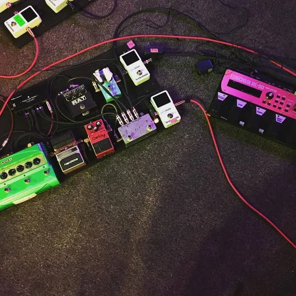
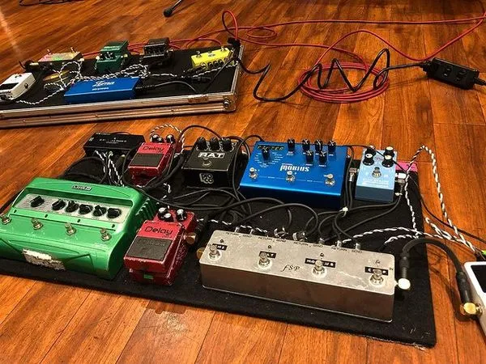
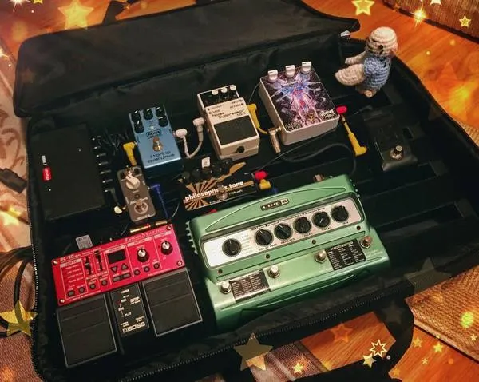
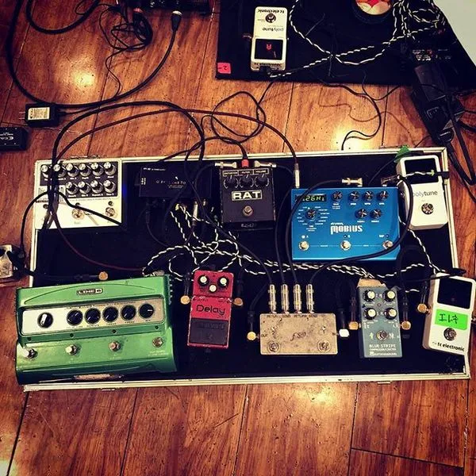
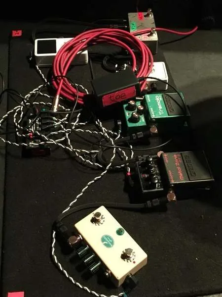
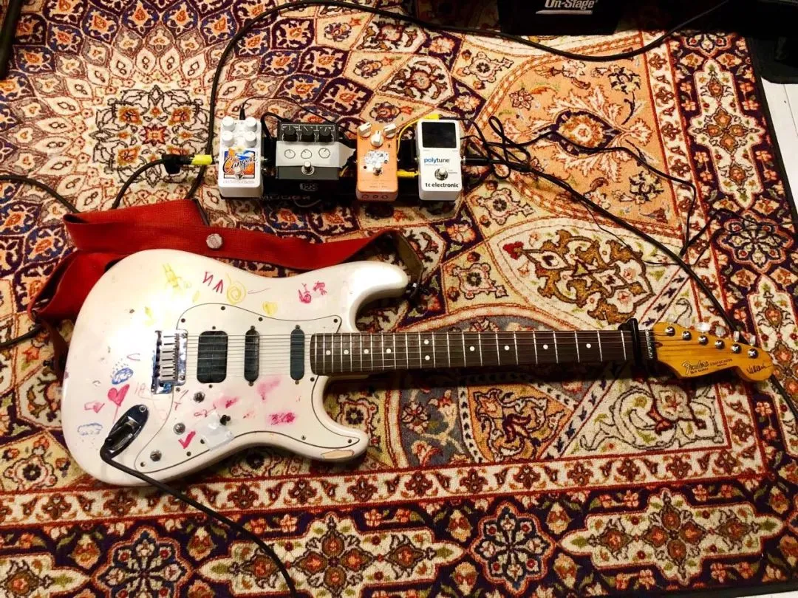
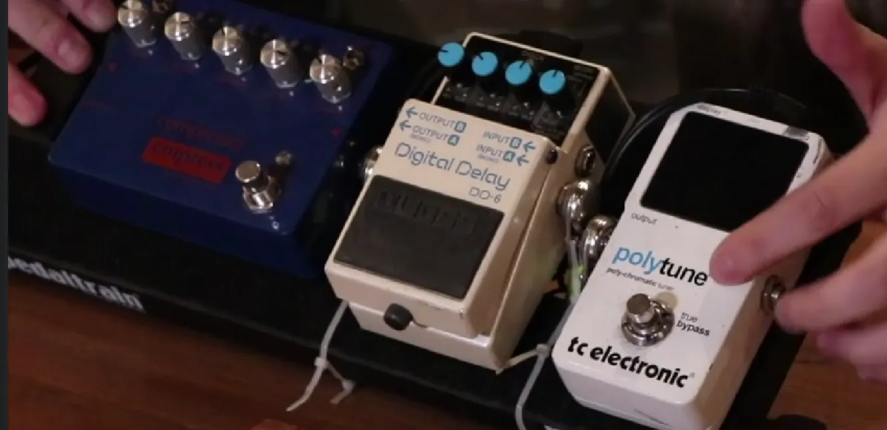
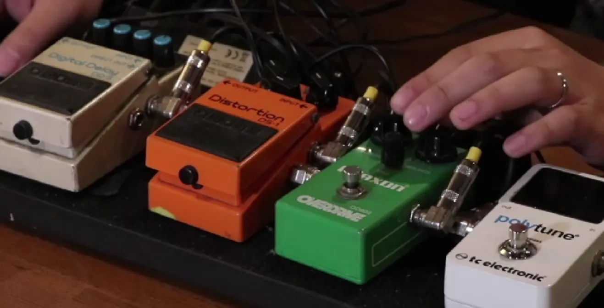
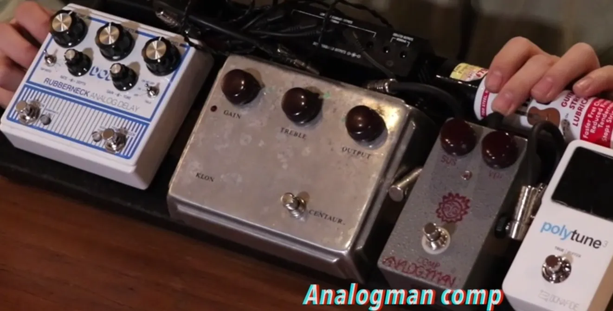

`素材来源网络，侵删`

- toe
    
    - Takaaki Mino
        
        
        
        
        
        
        
        
        
    - Yamazaki Hirokazu
        
        
        
    - Yamane Satoshi
        
        J bass, Ampeg **SVT-CL Classic, Steinberger L2**
        
- 上海秋天
    
    
    
    上海秋天 Enaut 2019
    
- 国足
    
    
    
    国足 李立鑫 2019 P bass
    
    
    
    国足 王博 2019 Telecaster
    
    
    
    国足 徐波 2019 Telecaster
    
    
    
    鼓手郑紫莉 用7A~5A鼓棒 知音K系列镲片